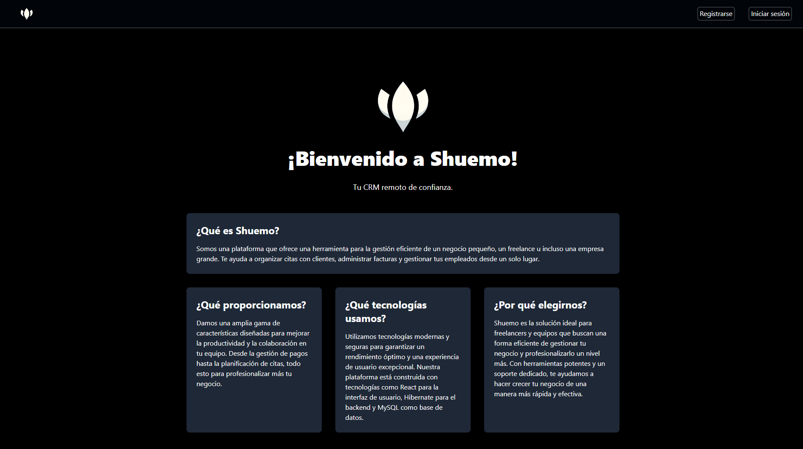

# [Shuemo](https://github.com/0spol/shuemo) · 

Shuemo is a basic CRM system designed to facilitate email sending via the Google Mail API. Created as a Final Year Project (TFG) developed by three collaborators: Erik - [MeLlamoTawet](https://github.com/MeLLamoTawet), Ariel - [AxxelESP](https://github.com/AxxelESP), and Gonzalo - [0spol](https://github.com/0spol).

# Screenshots

#### Technology Stack:
- **Backend:** Spring Boot, Hibernate, Lombok
- **Frontend:** React
- **Database:** MySQL
- **CSS Framework:** Tailwind CSS

#### Features:
- **Email Integration:** Integrates with Google Mail API for seamless email communication.
- **Database Management:** Uses MySQL for robust data storage and management.
- **UI/UX Design:** Utilizes Tailwind CSS for responsive and modern user interface design.
- **Java Development:** Leveraging Spring Boot and Hibernate for efficient backend development.
- **Component Streamlining:** Implements Lombok for reducing boilerplate code and improving code readability.

# Contributing
Read our [contributing guide](./CONTRIBUTING.md) to learn about our development process, how to propose bugfixes and improvements, and how to build and test your changes.

## Code of Conduct
This repository has adopted a Code of Conduct that we expect project participants to adhere to. Please read [the full text](./CODE_OF_CONDUCT.md) so that you can understand what actions will and will not be tolerated.

# License
This project is licensed under the [Apache 2.0](./LICENSE.md).